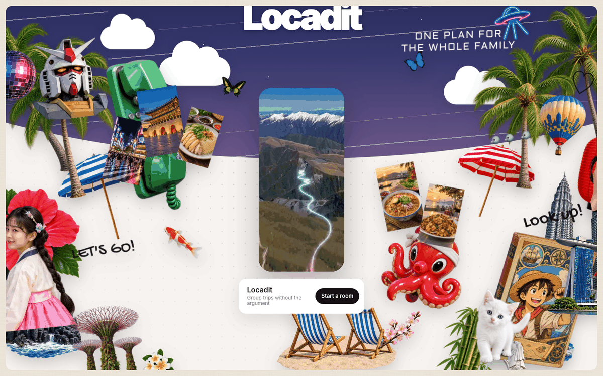
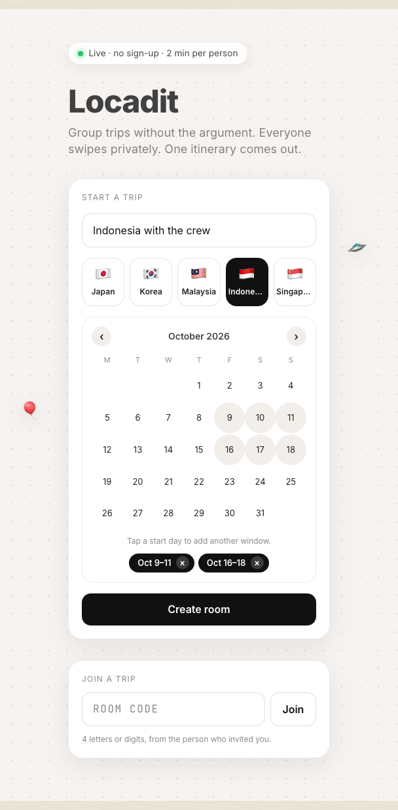
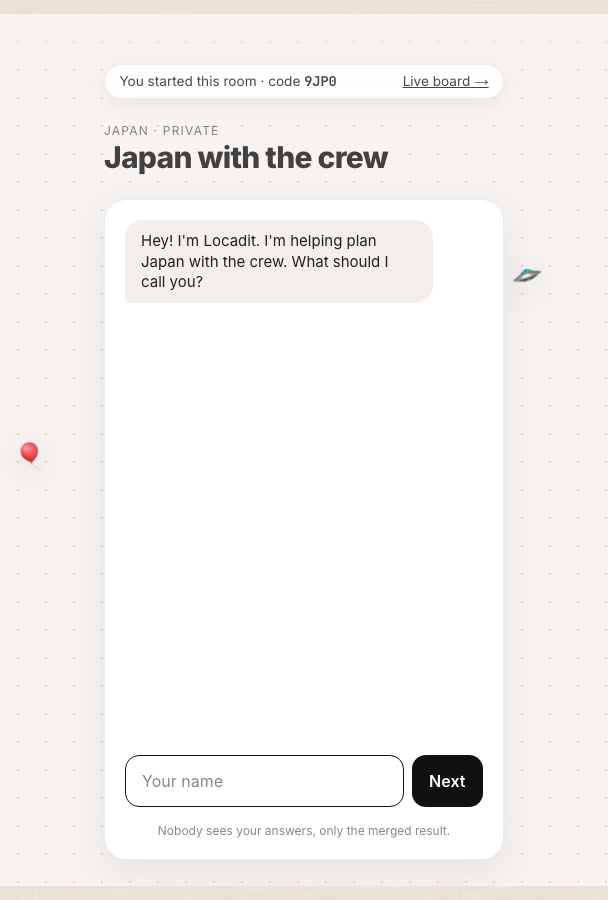
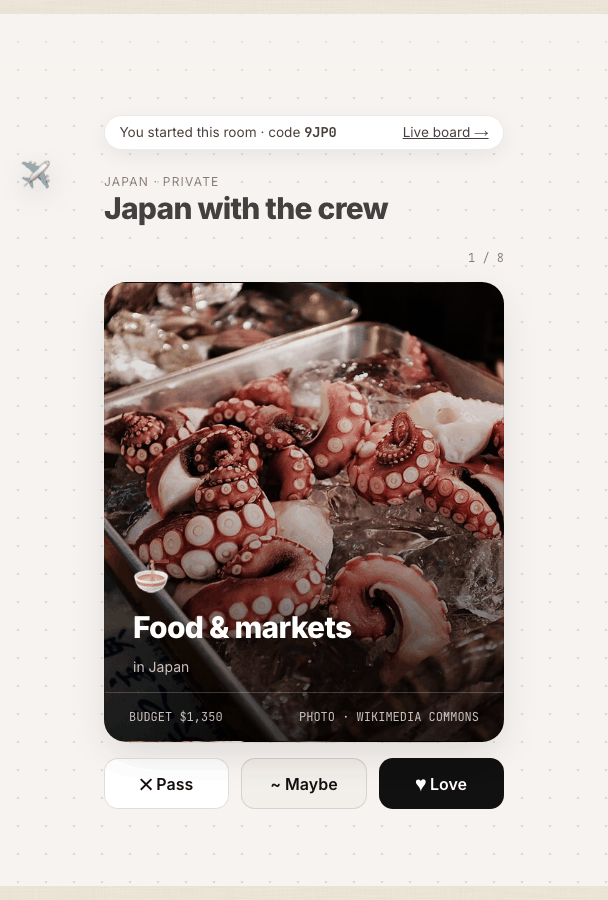
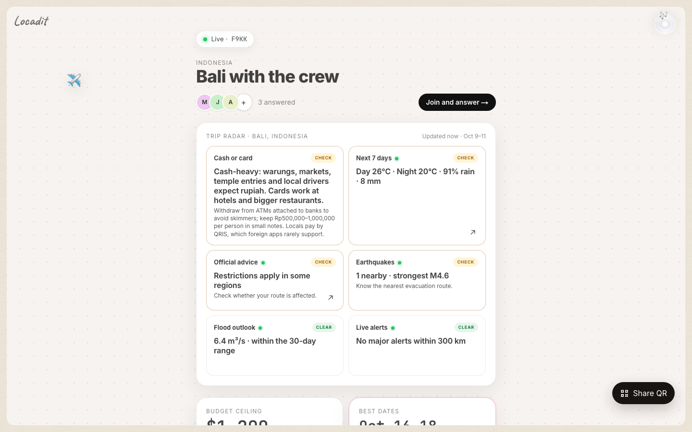
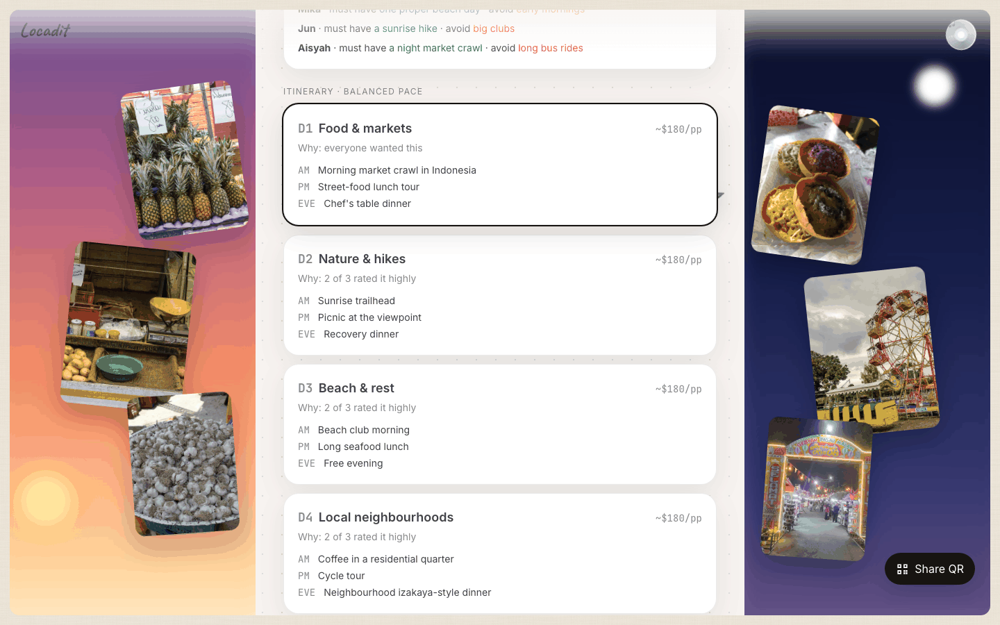
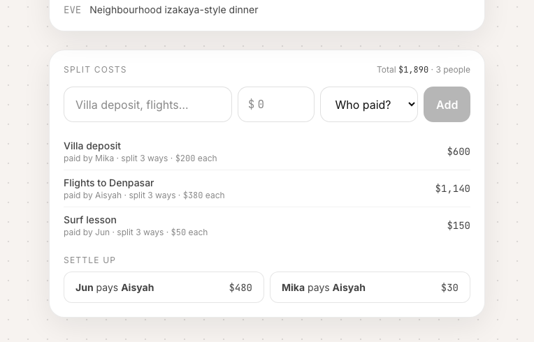
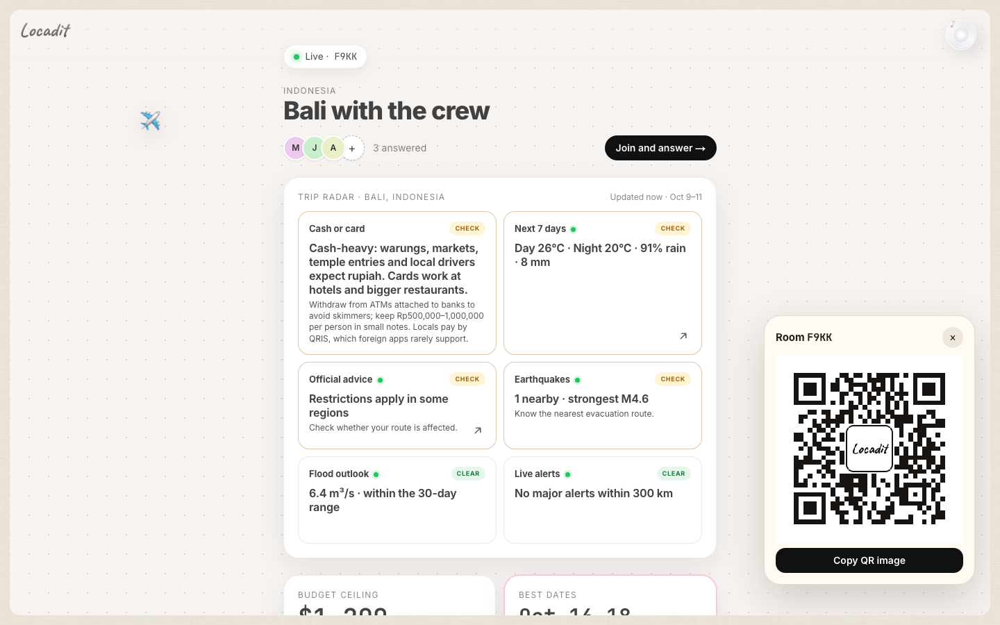
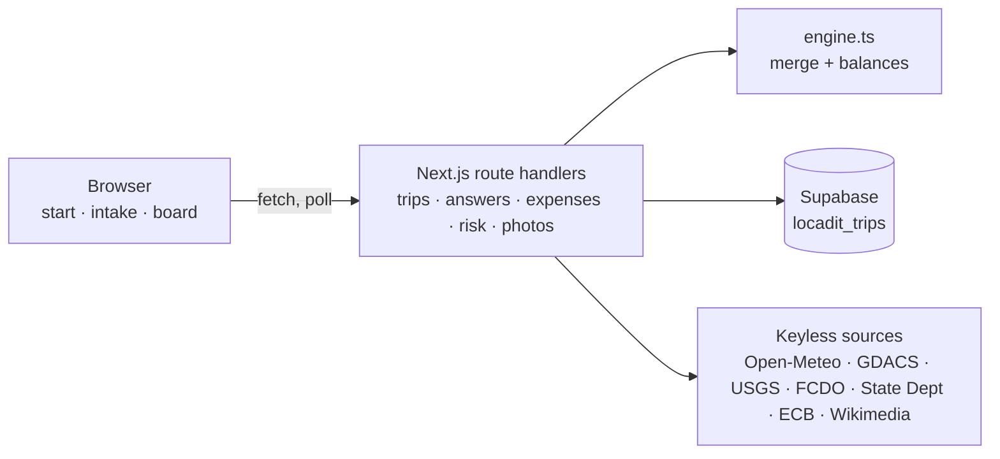

# Locadit by Odyssey

**Team:** Odyssey

**Problem Statement:** Travel Planner

**Video Presentation:** https://www.youtube.com/watch?v=5ZHclSxWhoU

<!-- Slides: add the link here -->

## 1. Project Overview

**The Problem.** Group trips are planned in a group chat, and the chat is where they fall apart. Dates, budget and pace go to whoever answers first and loudest. The person with the smallest budget stays quiet rather than say so in front of everyone. Costs are tracked after the money is spent, if at all. And nobody checks whether the place is safe for those dates until the news does it for them.

Stakeholders: the organiser who ends up doing all the work, the quiet member who overspends to keep the peace, the group that wants one plan it actually agreed to, and the families at home who want to know the group saw the warnings.

The case we design around is the August 2026 Nepal floods. A glacier collapse sent a debris flow through the Rasuwa valley, and hundreds of tourists on organised trips lost contact within days ([Al Jazeera](https://www.aljazeera.com/news/2026/8/27/nepal-tibet-floods-what-happened-what-caused-them-and-who-is-missing)). A weather average would not have flagged it. A live flood feed and disaster alerts in front of the group might have changed a decision.

| Similar app | What it does | Where it falls short |
|---|---|---|
| [Wanderlog](https://wanderlog.com/) | Collaborative itinerary with a shared budget tracker | One shared ledger, so the cheapest traveller has to out themselves. No safety layer. |
| [TripIt](https://www.tripit.com/) | Turns booking emails into one timeline, Pro adds travel alerts | Built for one traveller's bookings, not a group's decisions. Alerts reach the individual only. |
| [Splitwise](https://www.splitwise.com/) | Shared expenses with settle-up | Only after the money is spent. Nothing about dates, budget or the trip itself. |

**Our Solution.** Locadit is a room, not a chat. The organiser shares one link or QR code. Each traveller answers six short questions and swipes eight activity cards in private. The engine merges everyone's answers into one budget ceiling, one date window and a day-by-day itinerary that says why each day is there, while a live Trip radar grades the destination's safety from public data.

- **One link, no sign-up.** A 4-character room code, an invite link and a QR.
- **Private intake.** A six-question chat, then a swipe deck with real destination photos.
- **Consensus merge.** Lowest comfortable budget, the dates most people can make, majority pace, a "why" line per day.
- **Trip radar.** Weather, flood outlook, live disaster alerts, earthquakes, official advice, exchange rate, cash or card. Graded and cited per card.
- **Split costs.** Equal split with a settle-up list.
- **Live board.** Updates as people finish, on desktop and phone.

## 2. Ideation & Process

### 2.1 Ideas We Considered

| # | Idea | Why it was dropped / kept |
|---|------|---------------------------|
| **A (Chosen)** | **Consensus — group preference merging.** Each traveller privately swipes on activities, sets a budget band and blocks out dates. The engine merges everyone's inputs into one itinerary and explains the trade-offs, then splits every cost fairly. | **Kept.** Group coordination is the hardest problem named in the brief, and no mainstream app does it. It is highly demoable (judges scan a QR and swipe), the scoring algorithm is explainable on one slide, and it covers three of the four brief pillars (itinerary, budget split, group sync). |
| **B (Chosen)** | **Replan — the itinerary that fixes itself.** The itinerary is stored as a dependency graph (flight → check-in → dinner → tour). Live flight, weather and opening-hours signals mark broken nodes, and the AI proposes 2–3 repair plans that one tap applies and broadcasts to the group. | **Kept.** "Adjusting when things go wrong" is the pillar most teams will skip, so it is our sharpest differentiator. It composes naturally with A: Consensus builds the plan, Replan keeps it alive. Live flight status has a mock fallback so the demo cannot break on stage. |
| C | **Envelope — budget-first planning.** Enter one total number and the app works backwards, splitting it into envelopes (flights, stay, food, activities, buffer) and pulling live prices to propose destinations that actually fit. | **Dropped as a standalone product, partially absorbed.** Strong angle, but pricing APIs (Amadeus, Skyscanner) are rate-limited and flaky in a hackathon window, and the destination-discovery flow duplicated what A already does with group budget bands. We kept the envelope burn-down widget inside A's cost-split view. |
| D | **Bookings aggregator.** One search across flights, hotels and activities with deep links to checkout. | **Dropped.** Purely a wrapper over APIs we cannot fully access; Google Flights and Kayak already do it better. Adds no new value to the "piecing it together" problem. |
| E | **Group chat with an AI travel agent.** A WhatsApp-style room where a bot reads the conversation and turns it into bookings. | **Dropped.** Chat is where planning already fails (decisions get buried). We wanted structured inputs, not another thread. Kept the idea of a shareable room link with no sign-up. |
| F | **Solo "surprise trip" generator.** Give a budget and a weekend, get a sealed destination revealed at the airport. | **Dropped.** Fun but niche, does nothing for groups or for mid-trip changes, which are two of the four required pillars. |
| G | **Offline-first travel wallet.** Tickets, reservations and maps cached on device for no-signal moments. | **Dropped.** Useful but a utility rather than a planner. Storing confirmations is a feature we may add to Replan's node model later. |
| H | **Trip retrospective / memory book.** Auto-generate a shareable recap from photos, spends and the itinerary. | **Dropped.** Post-trip, so outside the "planning and adjusting" scope. Parked for a v2. |

**Final direction:** A + B merged into one product. Consensus handles the *before* (merge preferences, draft itinerary, split costs). Replan handles the *during* (detect breakage, repair, re-sync the group). Envelope's budget burn-down survives as a component.


### 2.2 Ideation Boards

#### Board 1 — Problem tree


Root problem at the top, causes in the middle, concrete effects at the bottom. The two highlighted branches (group misalignment and mid-trip breakage) became ideas A and B; the left branch is what every existing app already half-solves.

#### Board 2 — Idea mind map (Crazy Eights dump)


Every idea from our eight-minute sketch round, grouped after the fact. The "Group" and "Change" clusters had the most sticky notes and the fewest existing competitors, so we kept digging there.

#### Board 3 — 5 Whys on the "plans break" branch


The chain that produced Replan's core technical insight: model the itinerary as a dependency graph so a single broken node can be traced to everything it affects.

#### Board 4 — Merged user flow (A + B)


The end-to-end flow after merging Consensus (top half) and Replan (bottom loop). The two highlighted nodes are where the AI does real work; everything else is plumbing.

#### Board 5 — Keep / drop decision matrix


How we made the final cut. Consensus and Replan sit top-right. Envelope was novel but pulled left by unreliable pricing APIs, so it survives only as a widget.

*Where it went: the prototype implements A (Consensus) in full. B (Replan) became the Trip radar's live safety feeds, which watch the destination before and during the trip. The self-healing itinerary itself is scheduled for the building phase (section 5).*

### 2.3 Mentor Consultation

<!-- fill in each mentor session -->
| Date | Mentor | Feedback Received | What Was Changed |
|---|---|---|---|
| | | | |

## 3. Design & Prototype

**UI Prototype:** https://locadit-teal.vercel.app

Try it in two minutes: open `/start`, pick a destination and dates, create a room, then share the code or the QR.


*Landing. A collage builds up while the wordmark draws itself in, then a single card rises: Start a room.*


*Start a trip. Pick one of five destinations, tap start and end days on the calendar for up to four date windows, or join with a code.*


*Private intake. Locadit asks six short questions in a chat. The host pill shows the room code and the live board link.*


*Swipe deck. Eight activity cards with real Wikimedia Commons photos of the destination. Pass, Maybe or Love.*


*Live board. Who has answered, one button to join, and the Trip radar with graded, cited cards for the chosen dates.*


*Itinerary. Each day says why it is there. Tapping a day opens a day-to-night photo scene behind the board.*


*Split costs. Add an expense, it splits across the room, and Settle up reduces the balances to the fewest transfers.*


*Share. A QR code with the Locadit badge in the centre, ready to copy or scan.*

## 4. What Makes It Different

- **Private by default.** Everyone answers alone. The room only ever sees the merged result, so the tightest budget never has to speak up in public.
- **A "why" on every day.** Budget is the lowest comfortable maximum, the dates are the ones most people can make, pace is a majority vote. Each itinerary day explains itself.
- **Safety-first Trip radar.** Live, keyless public feeds graded Clear, Check or Act, each card citing its source, the urgent card first.
- **One link, no sign-up.** A room code, an invite link and a QR generated in the browser.
- **Settle-up in the fewest transfers.** Expenses split equally, balances collapse into a short "A pays B" list.

| | Locadit | Wanderlog | TripIt | Splitwise |
|---|:---:|:---:|:---:|:---:|
| Private preference intake | ✓ | – | – | – |
| Group agreement on dates, budget, pace | ✓ | – | – | – |
| Cost split with settle-up | ✓ | ✓ | – | ✓ |
| Live safety feeds inside the plan | ✓ | – | Pro only | – |

## 5. Technical Architecture & Feasibility

**Tech stack**

| Layer | Choice | Why | Constraint |
|---|---|---|---|
| Frontend | Next.js 16 App Router, React 19, TypeScript, Tailwind v4 | One codebase for pages and API, fast to ship | Board polls its API every 2.5 s, no realtime channel yet |
| Backend | Next.js route handlers on Vercel | No separate server to run | No auth. Anyone with the room code can read the room |
| Database | Supabase Postgres, one `locadit_trips` row per room (trip as jsonb) | Free tier, zero setup, upsert on every write | Row Level Security is off, so the anon key is used server-side only. In-memory fallback for local dev |
| Data sources | Open-Meteo (weather, GloFAS flood, geocoding), GDACS, USGS, UK FCDO, US State Dept, Frankfurter (ECB rates) | All keyless and public, cited on the card they feed | Fair-use limits. Every call has a timeout under a shared 7 s deadline, results cached 30 min to 24 h |
| Photos | Wikimedia Commons search | Real, free, credited photos | Relevance varies with the search term |
| Sharing | qrcode-generator in the browser | No third-party QR service | Copy image needs clipboard support, otherwise it downloads |
| Hosting | Vercel, manual CLI deploys, git auto-deploy disabled | Batched deploys stay under the Hobby plan cap | Serverless cold starts on the first radar load |

**System architecture**



**Build plan & scope** (3-week building phase)

1. **Replan.** Store the itinerary as a dependency graph. Weather, flood and GDACS triggers mark broken nodes, and one-tap repair proposals broadcast to the room.
2. **Group alerts.** Opt-in email at intake. A scheduled check re-grades the radar and notifies the room when a card changes grade.
3. **Hardening.** Row Level Security with a server-only key, raw answers hidden from the room API, room expiry, rate limits on the proxies.
4. **Stay point.** Let the group pin where it is staying so the radar and hospitals re-score around that point.
5. **Mobile polish and accessibility.** Focus order, contrast, reduced motion.

Out of scope: bookings, payments, user accounts, destinations beyond the current five (Japan, Korea, Malaysia, Indonesia, Singapore).

## Run it locally

```bash
npm install
npm run dev
```

Open http://localhost:3000. Create a room at `/start`; the organiser is taken straight into the intake with the room code and live-board link. Set `SUPABASE_URL` and `SUPABASE_ANON_KEY` in `.env.local` for persistence (a `locadit_trips` table with `code`, `data jsonb`, `updated_at`); without them rooms live in memory.
