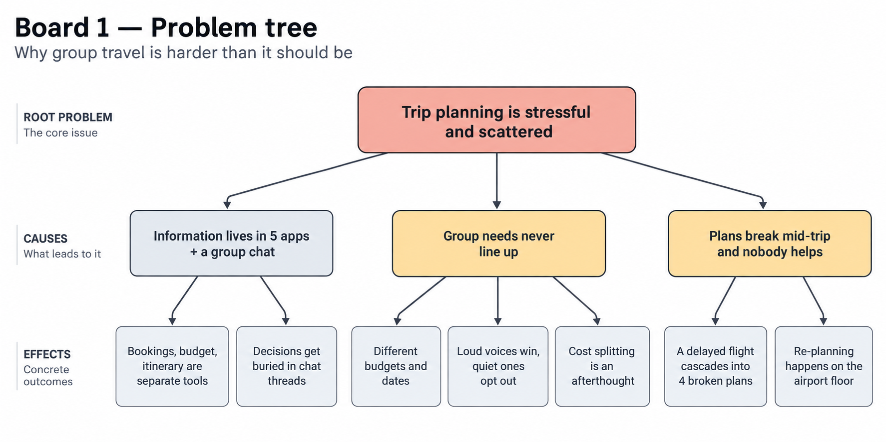
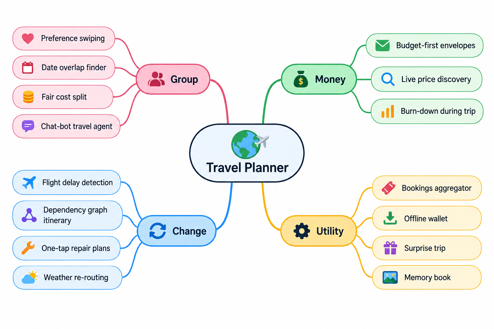
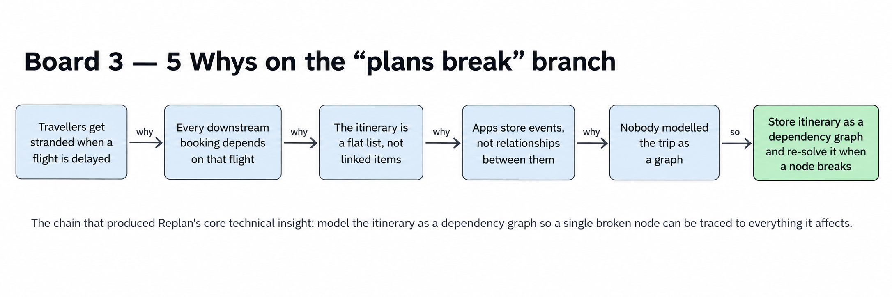
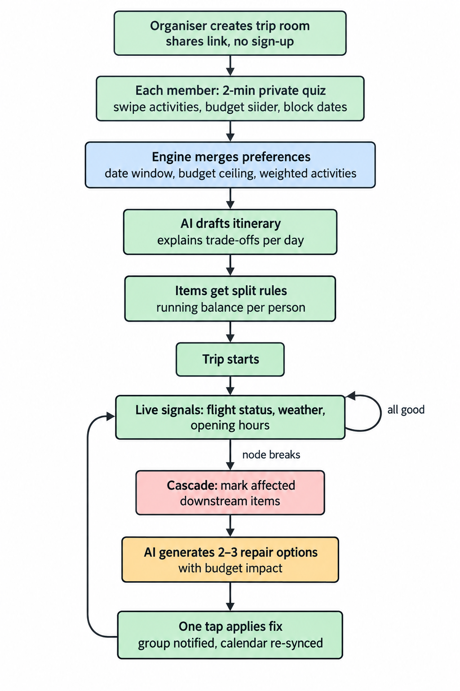
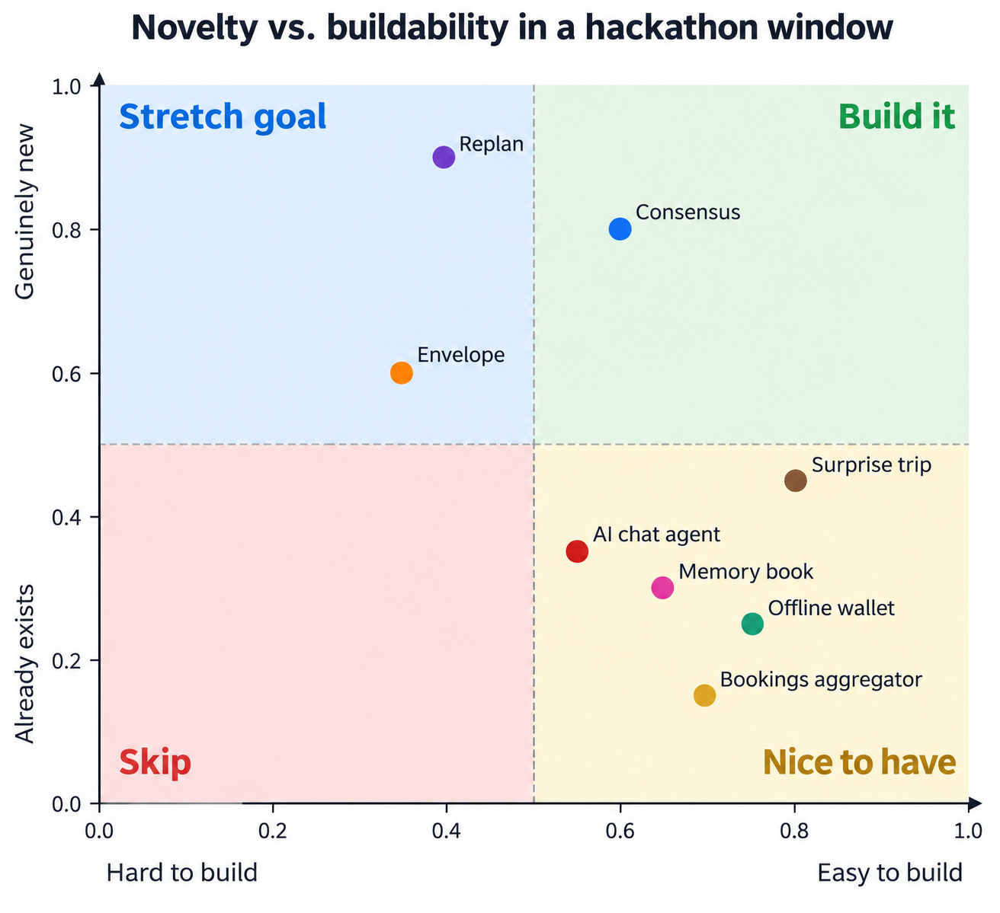

# Locadit

**Plan the trip together. Come home together.**

Locadit is for groups who travel with the people they love and refuse to gamble on safety. The idea is borrowed from how Luma and Eventbrite make gathering people effortless, a link, a room, everyone in. But this is not an event. It is a trip, and the first priority is not the itinerary. It is knowing, before anyone books, whether the place and the dates carry a natural-disaster risk, and having somewhere the warning can reach the whole group if the world changes mid-trip.

The 2026 Nepal flash floods, where hundreds of tourists on organised trips went missing after a glacier collapse, are the case Locadit is designed around. A weather average would not have flagged it. A live flood feed, rain extremes for the dates and a rescue-reality check might have changed a decision.

## What it does

1. **One link, no sign-up.** The organiser creates a room and shares a link or a tree-shaped QR code. Rooms persist in Supabase.
2. **Private intake.** Locadit asks each traveller six short questions in a chat: name, budget ceiling, dates, pace, one must-have, one thing to avoid. Then a swipe deck of activities with real photos of the destination. Nobody sees anyone else's answers.
3. **Merged plan.** The board turns everyone's answers into one budget ceiling, one date window and a day-by-day itinerary that explains why each day is there. Quiet voices get a day too. Costs split themselves with a settle-up list.
4. **Trip radar.** Before and during the trip, every card is real data with its source and date, graded Calm, Heads-up or Caution:
   - Rain extremes for your dates: ten years of daily totals, heaviest day, share of days over 50 mm, wet season flag (Open-Meteo archive).
   - Flood outlook: river discharge forecast against five years of history at that point (Copernicus GloFAS via Open-Meteo). Live.
   - Live alerts: GDACS disaster events within 300 km in the last 30 days. Live.
   - Volcanoes within 100 km and which erupted in the last decade (Smithsonian Global Volcanism Program).
   - Seismic activity: magnitude 4.5+ quakes within 300 km in the past year (USGS).
   - Tropical storm season by basin and month.
   - Government advice: UK FCDO status and US State Department level, fetched, not just linked. Live.
   - Getting out: nearest hospitals to where you are staying (OpenStreetMap), plus the boring things that decide outcomes: embassy number saved, offline maps, a meeting point.
   - Money: exchange rate and twelve-month volatility between the visitor's currency, inferred from location, and the destination's (ECB); inflation and homicide rate (World Bank).
   - Per-day temperature risk on the itinerary, stricter for outdoor days.
   Tell the radar where you are actually staying and it re-scores around that point: an Ubud villa and a Kuta beachfront are different trips.

Nothing here predicts a disaster. The point is to put the warnings people usually find afterwards in front of the group before they book, in language they can act on.

## Run

```bash
npm install
npm run dev
```

Open http://localhost:3000. Create a room at `/start`; the organiser is taken straight into the intake with the room code and live-board link. Set `SUPABASE_URL` and `SUPABASE_ANON_KEY` in `.env.local` for persistence (a `locadit_trips` table with `code`, `data jsonb`, `updated_at`); without them rooms live in memory.

## Landing intro

The home page opens with a staged intro: a faint dot grid, a handwritten wordmark that draws itself in, six typographic styles cycling while a collage builds up layer by layer, a golden-hour sky that falls to night, the wordmark tucking into the top edge, then a phone card rising into the cleared centre with its card. The collage pieces are the team's own cut-outs, themed on Malaysia, Singapore, Japan and Korea.

- Timeline and stage: `src/app/page.tsx`. Collage slots: `src/lib/collage.ts` and `docs/collage-slots.md`.
- Radar engine: `src/lib/risk.ts`. Currency: `src/lib/fx.ts`. Merge engine: `src/lib/engine.ts`. Storage: `src/lib/store.ts`.

## Stack

Next.js 16, React, Tailwind, Supabase, Web Audio for the soundtrack, no AI keys required. Every external source is keyless and cited on the card it feeds.

---

# 2. Ideation & Process

## 2.1 Ideas We Considered

| # | Idea | Why it was dropped / kept |
|---|------|---------------------------|
| **A (Chosen)** | **Consensus — group preference merging.** Each traveller privately swipes on activities, sets a budget band and blocks out dates. The engine merges everyone's inputs into one itinerary and explains the trade-offs, then splits every cost fairly. | **Kept.** Group coordination is the hardest problem named in the brief, and no mainstream app does it. It is highly demoable (judges scan a QR and swipe), the scoring algorithm is explainable on one slide, and it covers three of the four brief pillars (itinerary, budget split, group sync). |
| **B (Chosen)** | **Replan — the itinerary that fixes itself.** The itinerary is stored as a dependency graph (flight → check-in → dinner → tour). Live flight, weather and opening-hours signals mark broken nodes, and the AI proposes 2–3 repair plans that one tap applies and broadcasts to the group. | **Kept.** "Adjusting when things go wrong" is the pillar most teams will skip, so it is our sharpest differentiator. It composes naturally with A: Consensus builds the plan, Replan keeps it alive. Live flight status has a mock fallback so the demo cannot break on stage. |
| C | **Envelope — budget-first planning.** Enter one total number and the app works backwards, splitting it into envelopes (flights, stay, food, activities, buffer) and pulling live prices to propose destinations that actually fit. | **Dropped as a standalone product, partially absorbed.** Strong angle, but pricing APIs (Amadeus, Skyscanner) are rate-limited and flaky in a hackathon window, and the destination-discovery flow duplicated what A already does with group budget bands. We kept the envelope burn-down widget inside A's cost-split view. |
| D | **Bookings aggregator.** One search across flights, hotels and activities with deep links to checkout. | **Dropped.** Purely a wrapper over APIs we cannot fully access; Google Flights and Kayak already do it better. Adds no new value to the "piecing it together" problem. |
| E | **Group chat with an AI travel agent.** A WhatsApp-style room where a bot reads the conversation and turns it into bookings. | **Dropped.** Chat is where planning already fails (decisions get buried). We wanted structured inputs, not another thread. Kept the idea of a shareable room link with no sign-up. |
| F | **Solo "surprise trip" generator.** Give a budget and a weekend, get a sealed destination revealed at the airport. | **Dropped.** Fun but niche, does nothing for groups or for mid-trip changes, which are two of the four required pillars. |
| G | **Offline-first travel wallet.** Tickets, reservations and maps cached on device for no-signal moments. | **Dropped.** Useful but a utility rather than a planner. Storing confirmations is a feature we may add to Replan's node model later. |
| H | **Trip retrospective / memory book.** Auto-generate a shareable recap from photos, spends and the itinerary. | **Dropped.** Post-trip, so outside the "planning and adjusting" scope. Parked for a v2. |

**Final direction:** A + B merged into one product. Consensus handles the *before* (merge preferences, draft itinerary, split costs). Replan handles the *during* (detect breakage, repair, re-sync the group). Envelope's budget burn-down survives as a component.

---

## 2.2 Ideation Boards

### Board 1 — Problem tree



Root problem at the top, causes in the middle, concrete effects at the bottom. The two highlighted branches (group misalignment and mid-trip breakage) became ideas A and B; the left branch is what every existing app already half-solves.

### Board 2 — Idea mind map (Crazy Eights dump)



Every idea from our eight-minute sketch round, grouped after the fact. The "Group" and "Change" clusters had the most sticky notes and the fewest existing competitors, so we kept digging there.

### Board 3 — 5 Whys on the "plans break" branch



The chain that produced Replan's core technical insight: model the itinerary as a dependency graph so a single broken node can be traced to everything it affects.

### Board 4 — Merged user flow (A + B)



The end-to-end flow after merging Consensus (top half) and Replan (bottom loop). The two highlighted nodes are where the AI does real work; everything else is plumbing.

### Board 5 — Keep / drop decision matrix



How we made the final cut. Consensus and Replan sit top-right. Envelope was novel but pulled left by unreliable pricing APIs, so it survives only as a widget.
